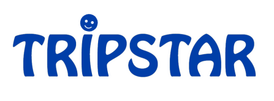
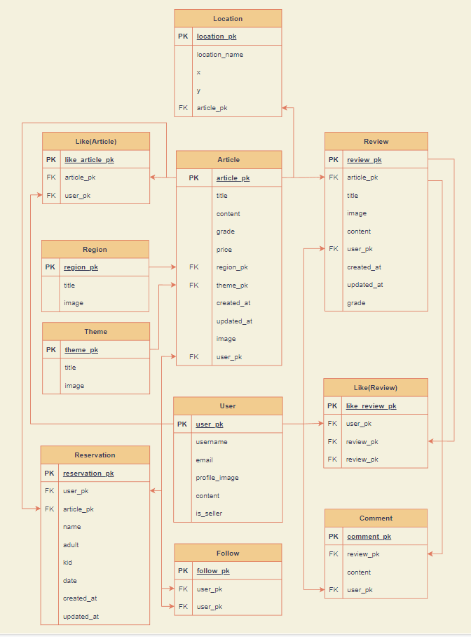
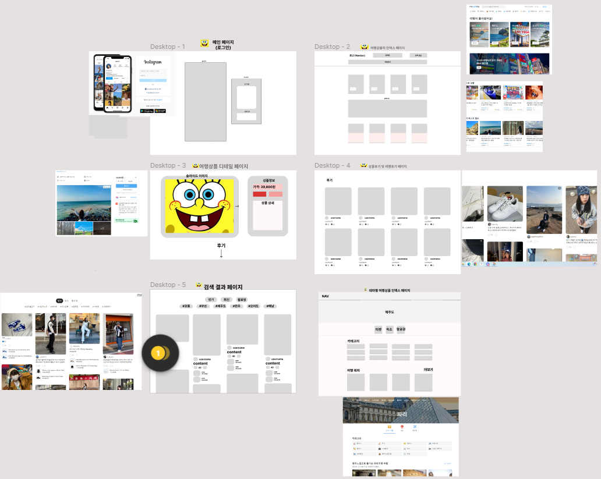
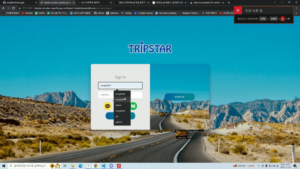
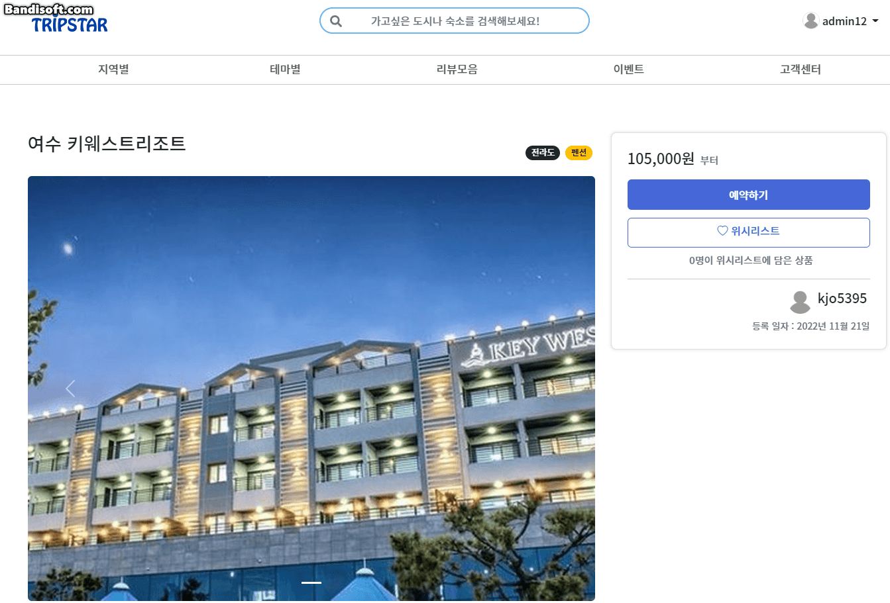
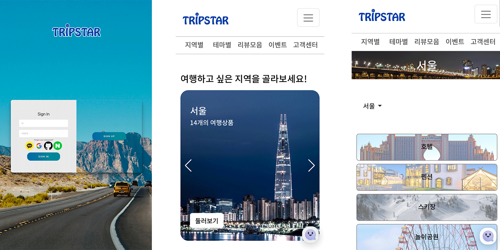
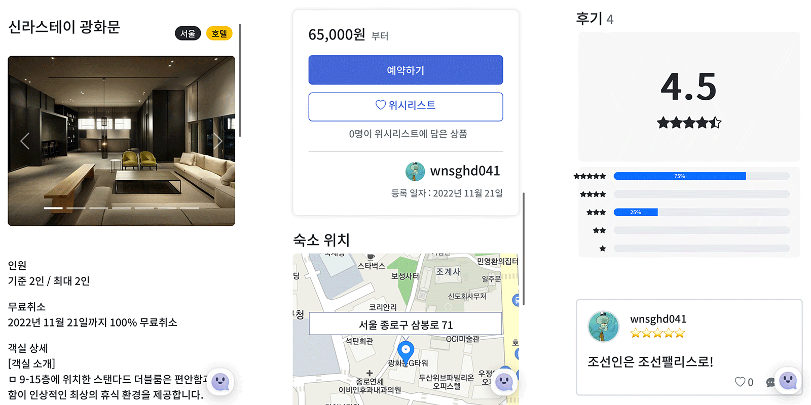
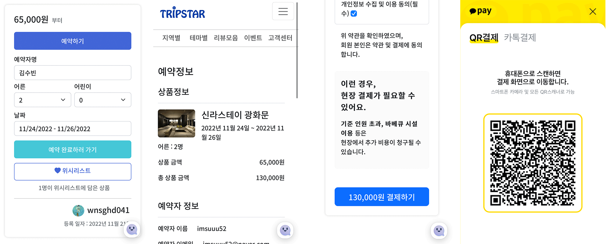
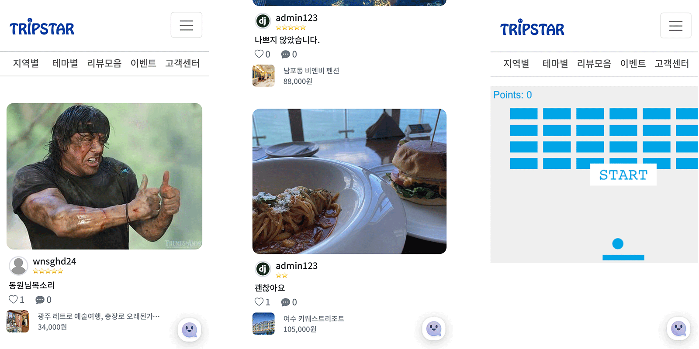
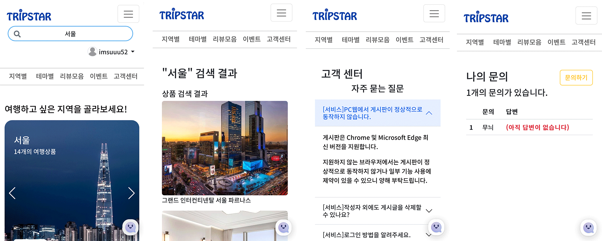

# TRIPSTAR 프로젝트

- [TripStar github](https://github.com/wnsghd14/semi_pjt2)
- [TripStar (배포 사이트)](http://tripstar-env.eba-rvqec9xz.ap-northeast-2.elasticbeanstalk.com/)

## ⭐ TRIPSTAR

### 서비스 소개

- 대한민국 팔도 여행 아이템 추천 및 판매

### 서비스 제작 기간

- 2022-11-09 ~ 2022-11-22

## 🔖 Table of Contents

- Contributors
- 기술 스택
- 팀원 소개 및 담당 역할
- 주요 기능 소개
- 화면 구성
- 프로젝트 후기

## 👨‍👩‍👧‍👦 Contibutors

- 최준홍

[wnsghd14 - Overview](https://github.com/wnsghd14)

- 백동원

[dongwonbaek - Overview](https://github.com/dongwonbaek)

- 김수빈

[buzzzlight - Overview](https://github.com/buzzzlight)

- 김재형

[jhkim9028 - Overview](https://github.com/jhkim9028)

- 김지연

[jn-97 - Overview](https://github.com/jn-97)

## ⚙️ Stack

        

## 🧑🏼‍💻 팀원 소개 및 담당 역할

- 최준홍

  👩‍💻팀장(Full-Stack)/ ⇒ articles:comments/ accounts:front-end/ chatbot/ front-end/ calender/ nav-bar/ event_page/ reset_password/ page_grid

- 김수빈

  👩‍💻팀원(Full-Stack) ⇒ articles:reviews/ articles:likes/ articles:images/ articles:reservation/ social_login/ reset_password/ page_grid

- 백동원

  👩‍💻발표자(Full-Stack) ⇒ accounts:follow/ articles:search/ region/ theme/ front-end/ recent_articles/ best_articles/ page_grid

- 김재형

  👩‍💻팀원(Full-Stack) ⇒ articles:articles/ cart:pay/ servicecenter/ region_index/ kakaomap_api/ front-end/ page_grid

- 김지연

  👩‍💻팀원(Full-Stack) ⇒ accounts:login,signup,logout etc../ cart:pay/ favicon/ login_signup design/ page_grid

## 🖥️ 주요기능

- 상품, 리뷰, 회원 CRUD, 비밀번호찾기
- 상품 좋아요, 리뷰 좋아요, 유저 별 팔로우 기능
- 지역과 테마를 기준으로 상품 분류
- 카카오 페이 데모결제, daterangepicker
- 소셜로그인
- 챗봇
- 상품별, 리뷰별, 유저별 검색내용 세분화
- 모바일 맞춤 반응형 웹
- 이벤트 페이지 미니게임(JS)
- 고객센터
- 리뷰모음 페이지
- 최근 본 상품과 베스트 상품
- 카카오 맵 api 사용

## 프로젝트 자료

[14팀. 트립스타](https://www.notion.so/14-ce358022f6fd4e30bdb5d7a93f4e5966) 

## 기획 단계

### ERD Model 설계

### Template 설계

## 화면 구성

### 서비스 화면 전반

### 로그인 페이지

### 메인 화면

### 상품 상세 - 리뷰, 예약, 결제

### 리뷰 모음 및 이벤트

### 모바일 반응형 페이지

#### 메인

#### 상품 상세

#### 예약 및 결제

#### 리뷰모음 및 이벤트

#### 검색 및 문의

## 개발 이슈

## 🌕 프로젝트 후기

- 김지연
  - 이번 프로젝트를 진행하면서 세미 프로젝트를 진행했을 때보다 규모가 커지면서 생기는 오류들이 많았지만, 그 오류들을 하나하나 다 같이 해결해나감에 있어서 뿌듯하고 한층 성장한 느낌이 들었습니다.
- 최준홍
  - 오픈소스를 사용하면서 아직 많은것을 배워야 겠다 생각했고,
    기본적인 개념이 부족하여 실수가 잦았던 것 같습니다.
    하지만 배려심 많고 끈기있는 팀원들 덕분에 재밌게 할 수 있었고
    무엇보다 많이 배울 수 있었어서 좋았습니다!
    불편하고 힘들었을 수 있었겠지만
    저랑 같이해주셔서 너무 감사합니다 사랑해요 츄립스타
- 백동원
  - 사용해본 적 없는 기능들을 구현해봐서 많은 어려움이 있었지만
    팀원들과 함께 고민해서 해결할 수 있었습니다.
    역시 팀프로젝트는 함께 해서 해결할 수 있는 것이 가장 중요한
    장점이라는 것을 또 한번 느꼈습니다. 많이 배울 수 있어서 좋았습니다.
- 김수빈
  - 트립스타 프로젝트를 진행하면서 처음 구현해보는 기능도 많고 전에 했던 프로젝트들보다 새로운 기능이 많이 추가되어서 어렵기도 했지만 다양한 기능을 구현해 볼 수 있어서 좋았습니다. 무엇보다 좋은 팀원분들을 만나서 많이 배우고 성장할 수 있었던 것 같아서 만족스러웠던 프로젝트 였습니다!!
- 김재형
  - 다양한 기능들을 추가해보면서 지난 프로젝트 때보다 더 성장한 느낌이 들고 좋은 팀원들을 만나 재밌게 진행할 수 있었습니다. 또 많이 배울 수 있어 뜻깊은 시간이 었습니다
